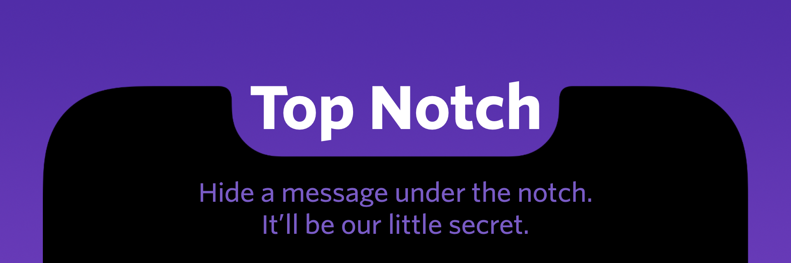

# ``TopNotch``



## Overview

TopNotch is a lightweight Swift package that lets developers hide a custom view underneath the device’s notch—ideal for displaying a watermark or secret message. It automatically calculates the notch’s exclusion area (using an undocumented `_exclusionArea` property on UIScreen) and applies manual, device-specific adjustments to ensure proper display across various iPhone models.

> **Warning:** Because TopNotch relies on undocumented APIs, it may not be App Store safe.

## Features

- **Automatic Exclusion Calculation:** Uses the device’s exclusion area to position your custom view.
- **Device-Specific Adjustments:** Applies series overrides for iPhone13 and iPhone14 models (and can be further customized) to ensure correct sizing and rounded corner rendering.
- **Customizable Appearance:** Supply your own view or use the default red‑tinted view.
- **Task Switcher Handling:** Optionally hides the view when the task switcher is invoked.

## Installation

To integrate TopNotch into your project, add it via [Swift Package Manager](https://swift.org/package-manager/) or include the source files directly.

## Usage

In your code, simply call:

```swift
// Create a custom view (or use your own) to display behind the notch.
let notchLabel = UILabel()
notchLabel.text = "Top Notch"
notchLabel.textAlignment = .center
notchLabel.textColor = .white
notchLabel.backgroundColor = UIColor.systemBlue.withAlphaComponent(0.7)

// Show the notch view.
TopNotchManager.shared.show(customView: notchLabel, with: TopNotchConfiguration(animationDuration: 0.3,
                                                                                   shouldAnimate: true,
                                                                                   shouldHideForTaskSwitcher: true))

// To hide it:
TopNotchManager.shared.hide()
